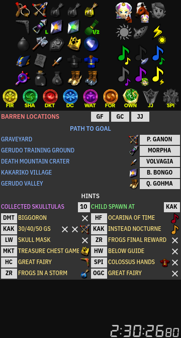

# Fire Arrow [![Made with Godot 3.5][badge]][godot]

A cross-platform, simple item and hint display tracker for OoTR, humbly made
with Godot Engine.

> **Note**: This is a proof-of-concept, at its early stages of
> development. While I tried my best to make it work without issues, it might
> still contain some unexpected bugs, **use it at your on risk**!
>
> Project migration for Godot Engine 4.0 (beta) should begin shortly.

## What is it?

This is a small, item and hint display tracker, intended to aid on OoTR games,
friendly races and matches of the "Standard" randomizer category.

It contains the usual features found in similar trackers, including:

- Highlightable progression item icons;
- Song icons, which can be dragged and dropped over each other;
- Prizes –medallions and stones– required to beat the game, and their respective
  dungeon labels;
- An area to annotate locations of interest and predefined miscellaneous hints.

### Quick guide

As expected, using Fire Arrow should be quick and simple:

- Use the mouse to click an item, song or prize icon to highlight (activate)
  it; drag and drop any of these icons over the hints below.

- Drag and drop a song icon over another one to highlight what song you
  just got instead (this feature can be tweaked, see below).

- You can also drag and drop prize icons over one another to change their
  labelled dungeons (this feature can also be tweaked, see below).

- Enter location and gossip stone hints using the keyboard. Each kind has its
  own keyboard shortcut and grouping. Miscellaneous hints (including "always",
  "sometimes", generic counters and spawn locations) are grouped together.

  When you start entering hints, a short filter list will appear, just keep on
  typing until you find the entry you need: it has "fuzzy search", so you don't
  have to type the exactly text. Use the arrows and the Enter key to select and
  choose the desired location name or hint.

  To remove a hint, click it with the right mouse button. You can also interact
  with hints using the mouse wheel in a few places, just try it!

  > **Note**: At the moment, it is only possible to start annotating hints using
  > the keyboard. That will change on future revisions of the tracker.

- Finally, you can start, pause, resume and reset the stopwatch at the bottom
  using the mouse or the keyboard.

### Keyboard shortcuts

> **A friendly reminder for those who play OoTR on console emulators**:
> Some keyboard shortcuts might overlap with those of some emulators (e.g.
> Retroarch) with unintended consequences. Pay careful attention when using the
> tracker, as it only responds to actions while its window is focused.

| Keyboard Shortcut  | Function                              |
|:------------------:|---------------------------------------|
| <kbd>B</kbd>       | Add irrelevant (barren) location      |
| <kbd>G</kbd>       | Add goal location                     |
| <kbd>H</kbd>       | Add hint                              |
| <kbd>A</kbd>       | Set adult spawn location              |
| <kbd>C</kbd>       | Set child spawn location              |
| <kbd>F12</kbd>     | Take screenshot                       |
| <kbd>F2</kbd>      | Start, pause and resume the stopwatch |
| <kbd>Ctrl+F2</kbd> | Reset the tracker                     |
| <kbd>Ctrl+F4</kbd> | Reset the stopwatch                   |
| <kbd>Ctrl+O</kbd>  | Open the app data folder              |
| <kbd>Ctrl+Q</kbd>  | Quit the app                          |

### Location symbol reference

| Symbol | Name                     | Symbol | Name                     |
|:------:|--------------------------|:------:|--------------------------|
| `BOTW` | Bottom of the Well       | `JJ`   | Inside Jabu-Jabu's Belly |
| `DMC`  | Death Mountain Crater    | `DKT`  | Inside the Deku Tree     |
| `DMT`  | Death Mountain Trail     | `KAK`  | Kakariko Village         |
| `COL`  | Desert Colossus          | `KF`   | Kokiri Forest            |
| `DC`   | Dodongo's Cavern         | `LH`   | Lake Hylia               |
| `FIR`  | Fire Temple              | `LLR`  | Lon Lon Ranch            |
| `FOR`  | Forest Temple            | `LW`   | Lost Woods               |
| `GTG`  | Gerudo Training Ground   | `MKT`  | Market                   |
| `GV`   | Gerudo Valley            | `OGC`  | Outside Ganon's Castle   |
| `GF`   | Gerudo's Fortress        | `SFM`  | Sacred Forest Meadow     |
| `GC`   | Goron City               | `SHA`  | Shadow Temple            |
| `GY`   | Graveyard                | `SPI`  | Spirit Temple            |
| `HW`   | Haunted Wasteland        | `TOT`  | Temple of Time           |
| `HC`   | Hyrule Castle            | `WAT`  | Water Temple             |
| `HF`   | Hyrule Field             | `ZD`   | Zora's Domain            |
| `IC`   | Ice Cavern               | `ZF`   | Zora's Fountain          |
| `GAN`  | Inside Ganon's Castle    | `ZR`   | Zora's River             |

### Configuration

Settings are kept in a `preferences.cfg` file, located inside the application
data folder. Typing <kbd>Ctrl+O</kbd> while the app is running will open that
folder for you:

- On Linux: `$HOME/.local/share/Fire Arrow`
- On Windows: `%APPDATA%\Fire Arrow`

At the moment, it can only be changed by editing its contents manually. You need
to run and quit the program at least once to create it.

The configuration keys are explained below:

- **`songs/autocheck`**: Changes whether little song icons are highlighted
  automatically or not when drag-and-dropping other song icons. Change that
  value to `false` if you don't want little song icons automatically
  highlighted.

- **`songs/check_in_reverse`**: Changes the way little song icons are
  highlighted:

  - **`false`**: Drag the icon of the song you have found over the song icon
    you're supposed to get in the vanilla game, e.g. dragging "Saria's Song"
    over "Sun's Song" will highlight "Saria's Song" and place a small icon under
    "Sun's Song";

  - **`true`**: Drag the song icon you're supposed to learn over the one you
    actually learned, e.g. dragging "Sun's Song" and dropping over "Saria's
    Song" will both highlight the "Saria's Song" and place a small "Sun's Song"
    icon under "Saria's Song".

- **`prizes/check_in_reverse`**: Similar to how song icons behave:

  - **`false`**: A medallion or stone is assigned the dungeon of the opposite
    prize, e.g. dragging the "Water Medallion" and dropping over the "Goron
    Ruby" will assign "Dodongo's Cavern" to "Water Medallion";

  - **`true`**: Dragging a medallion or stone and dropping on another prize will
    assign the dungeon of the former on to the latter, e.g. dragging the "Goron
    Ruby" and dropping over the "Water Medallion" will assign "Dodongo's Cavern"
    to "Water Medallion".

- **`preset/mode`**: Changes how hint annotations work and are displayed on the
  tracker. Currently, two presets are available:

  - **`standard_s5`**: Legacy, Standard Season 5 settings, allowing 3 barren
    places, 5 goal paths, 7 preset pinned hints and 5 occasional hints.

  - **`standard_s6`**: Standard Season 6 settings, allowing 5 goal paths, 7
    pinned hints and 8 occasional hints. The default one.

## License

[MIT](LICENSE.md).

[badge]: https://flat.badgen.net/badge/made%20with/Godot%203.5/478cbf
[godot]: https://godotengine.org/
