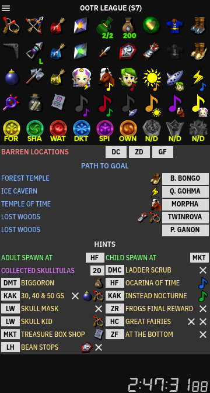

# Fire Arrow [![Made with Godot 4.2][badge]][godot]

A simple item and hint display tracker for OoTR, humbly made with Godot Engine.
Available for Windows and Linux.

> **Note**: While I tried my best to make this app bug-free, it might still
> contain some. **Using this tracker for races is not recommended yet.** Please,
> familiarize yourself with the tracker's interface and test it thoroughly. If
> you happen to find any bugs, I kindly ask you to file an issue report as soon
> as possible.

## What is it?

This is a small, item and hint display tracker, intended to aid on OoTR games,
friendly races and competitive matches of the "Standard" category.

It contains the usual features found in similar trackers, including:

- Highlightable progression item icons;
- Song icons, which can be dragged and dropped over each other;
- Prizes –medallions and stones– required to beat the game, and their respective
  dungeon labels;
- An area to annotate locations of interest and predefined miscellaneous hints.

### Quick guide

As expected, using Fire Arrow should be quick and simple:

- Use the mouse to click an item, song or prize icon to highlight it; drag and
  drop any of these icons over any hints below.

- Drag and drop a song icon over another one to highlight what song you just got
  instead (this can be tweaked through the "Settings" dialog).

- You can also drag and drop prize icons over one another to change their
  labelled dungeons (this can be tweaked through the "Settings" dialog), or use
  the mouse wheel to rotate its options.

- Enter locations and gossip stone hints using the keyboard or clicking the name
  of the hint category. Miscellaneous hints (including "always", "sometimes",
  generic counters and spawn locations) are grouped together.

  When you start entering hints, a short filtered list will appear. Just type
  a few letters and select what you need: it has "fuzzy search", so you don't
  need to type the exact match. Use the arrows keys and the Enter key to choose
  and confirm the desired location or hint.

  To remove a hint, click it with the right mouse button. You can also interact
  with hints using the mouse wheel in a few places, just try it!

- Finally, you can start, pause, resume and reset the stopwatch at the bottom
  using the mouse or the keyboard.

### Available hint presets

Currently, the following list of hint annotation presets are bundled with the
tracker:

- **OoTR League (Season 7)**: 3 barren locations, 5 goal paths, 6 pinned hints
  and up to 8 occasional hints (either single or dual hints).

- **Scrubs Tournament (Season 5)**: 3 barren locations, 5 "Way of the
  Hero" locations, 9 pinned hints and capacity for up to 7 occasional hints.

- **Tournament of Truth**: up to 4 barren locations, 5 paths to rewards, 7
  pinned hints and capacity for up to 10 occasional hints (either single or dual
  hints).

- **Copa do Brasil de OoTR**: with 3 barren locations, 5 paths to rewards, 9
  pinned hints and capacity for up to 7 occasional hints (either single or dual
  hints).

- **Standard (Season 6)**, allowing 5 goal paths, 7 pinned hints and 8
  occasional hints.

Use the "Presets" command of the app menu to switch to any option.

### Keyboard shortcuts

> **A friendly reminder for those who play OoTR on console emulators**:
> Some keyboard shortcuts might overlap with those of some emulators (e.g.
> Retroarch) with unintended consequences. Pay careful attention when using the
> tracker, as it only responds to actions while its window is focused.

| Keyboard Shortcut    | Function                              |
|:--------------------:|---------------------------------------|
| <kbd>B</kbd>         | Add a barren location                 |
| <kbd>G</kbd>         | Add a goal location                   |
| <kbd>H</kbd>         | Add an item hint                      |
| <kbd>A</kbd>         | Set adult spawn location              |
| <kbd>C</kbd>         | Set child spawn location              |
| <kbd>F12</kbd>       | Take a screenshot of the tracker      |
| <kbd>F4</kbd>        | Start, pause and resume the stopwatch |
| <kbd>Ctrl+F4</kbd>   | Reset the stopwatch                   |
| <kbd>Ctrl+F2</kbd>   | Reset the tracker                     |
| <kbd>Ctrl+D</kbd>    | Open settings dialog                  |
| <kbd>Ctrl+Q</kbd>    | Quit the app                          |
| <kbd>Shift+F10</kbd> | App menu shortcut                     |

### Location symbol reference

| Symbol | Name                     | Symbol | Name                     |
|:------:|--------------------------|:------:|--------------------------|
| `BTW`  | Bottom of the Well       | `JJ`   | Inside Jabu-Jabu's Belly |
| `DMC`  | Death Mountain Crater    | `DKT`  | Inside the Deku Tree     |
| `DMT`  | Death Mountain Trail     | `KAK`  | Kakariko Village         |
| `COL`  | Desert Colossus          | `KF`   | Kokiri Forest            |
| `DC`   | Dodongo's Cavern         | `LH`   | Lake Hylia               |
| `FIR`  | Fire Temple              | `LLR`  | Lon Lon Ranch            |
| `FOR`  | Forest Temple            | `LW`   | Lost Woods               |
| `GTG`  | Gerudo Training Ground   | `MKT`  | Market                   |
| `GV`   | Gerudo Valley            | `OGC`  | Outside Ganon's Castle   |
| `GF`   | Gerudo's Fortress        | `SFM`  | Sacred Forest Meadow     |
| `GC`   | Goron City               | `SHA`  | Shadow Temple            |
| `GY`   | Graveyard                | `SPI`  | Spirit Temple            |
| `HW`   | Haunted Wasteland        | `TOT`  | Temple of Time           |
| `HC`   | Hyrule Castle            | `WAT`  | Water Temple             |
| `HF`   | Hyrule Field             | `ZD`   | Zora's Domain            |
| `IC`   | Ice Cavern               | `ZF`   | Zora's Fountain          |
| `GAN`  | Inside Ganon's Castle    | `ZR`   | Zora's River             |

## License

[MIT](LICENSE.md).

[badge]: https://flat.badgen.net/badge/made%20with/Godot%204.2/478cbf
[godot]: https://godotengine.org/
